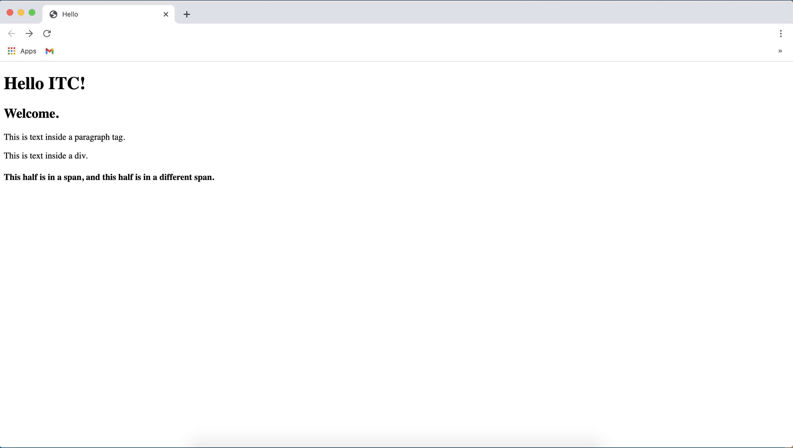
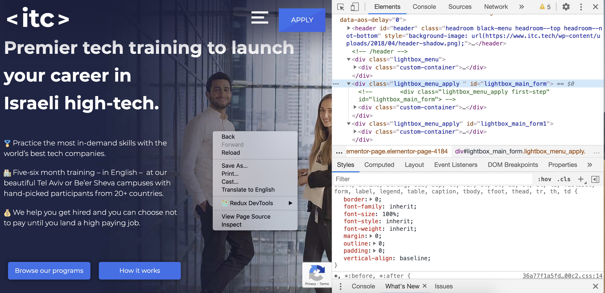
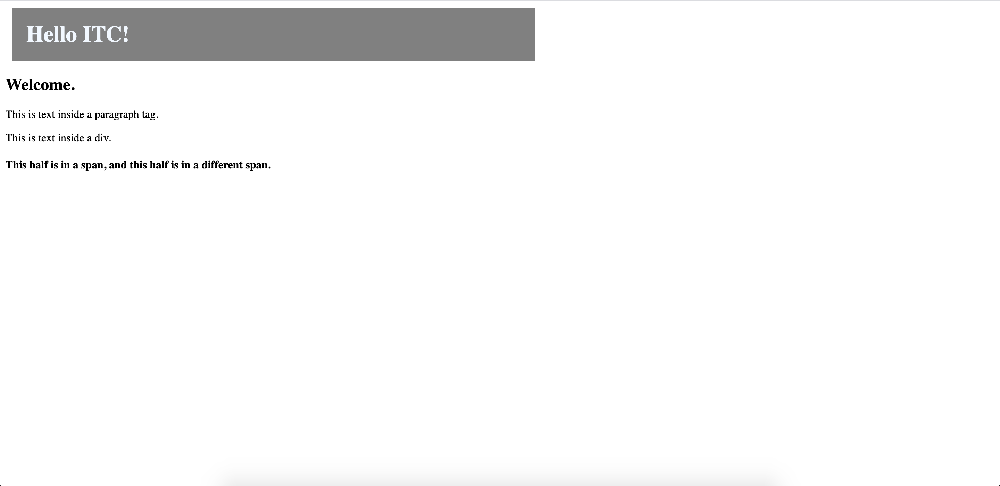
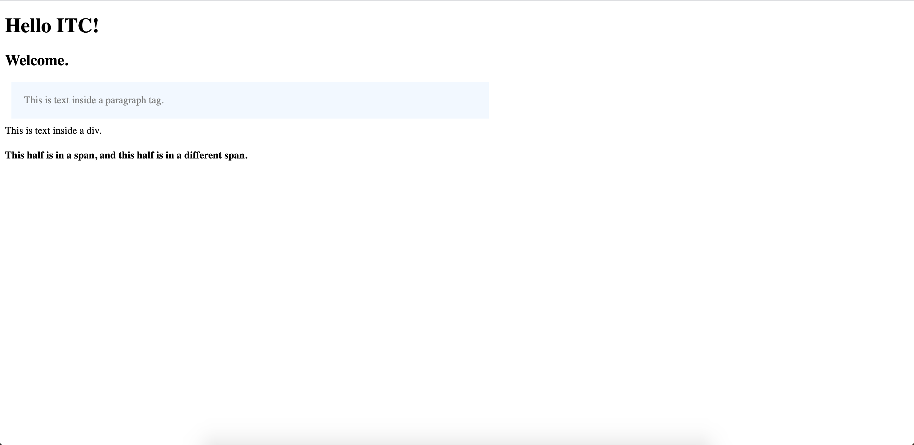
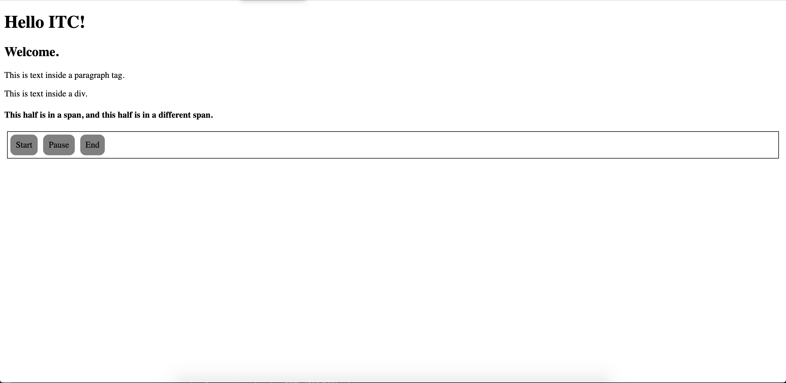
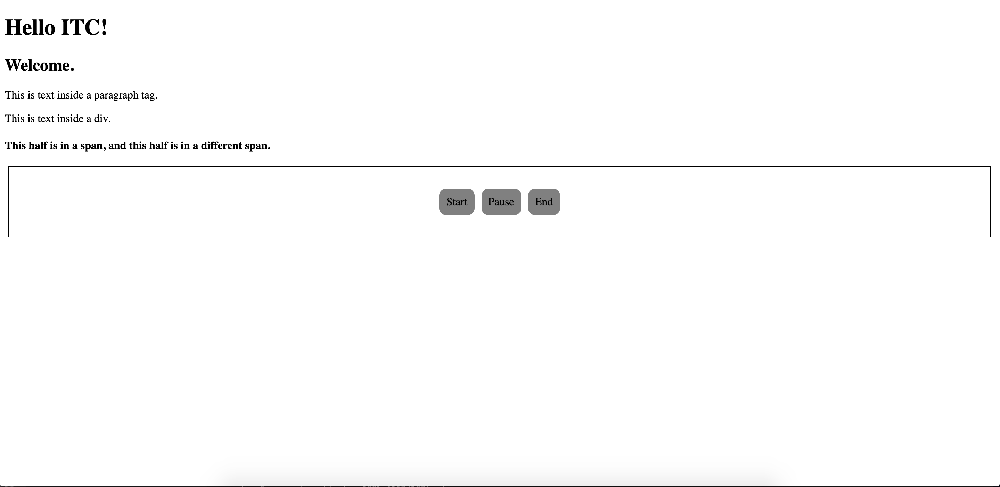
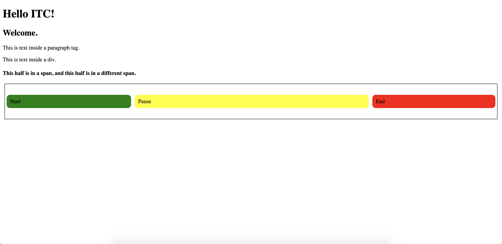

# Day 1: HTML and CSS Basics

HTML, CSS, and JavaScript are the three main languages requried for building the frontend of a web application. HTML and CSS are used primarily to organize and style the contents of a webpage, and JavaScript is used to provide functionality.

When a user opens a browser on their computer, the browser requests from a server the files it needs to display the website to the user. Those files include the HTML, CSS, and JavaScript files the browser needs to build the webpage (i.e., the source code), plus any images, videos, and other files that the webpage displays. The browser uses the source code and other files to assemble the webpage for the user to see and interact with.

Here in this lesson, first, you cover the very basics of HTML and CSS. Then, you dive into more intermediate topics like CSS selectors for custom styling HTML elements. 

In this lesson, you also learn about flexbox, a powerful toolset for creating layouts for multiple HTML elements in either a row or column. In later chapters, you learn about using CSS to position individual elements (`position` and its cousins) and to position multiple elements using Grid (columns *and* rows). In a later chapter, you learn a fourth layout option, too, which is using Bootstrap's layout system. 

Although this lesson assumes you already have some HTML, CSS, and JavaScript skills, it is not required that you do.

By the end of this lesson, you will have:

- A refresher on HTML and CSS basics
- An intro to CSS Selectors
- Flexbox basics
- Self-study resources for learning about pseudo elements

## [HTML and CSS Refresher](#html-and-css-refresher)

HTML and CSS are languages that instruct the browser how to display the contents on the page. HTML defines the elements of the page. The elements of the page consist of text, images, videos, content blocks, and more. HTML and CSS together define the style of the elements. The element styles include the size, spacing, color, font, and more.

### A webpage is a document

Before going further, here is an example of a basic HTML document, which the browser reads from top to bottom:

```html
<!DOCTYPE html>
<html>
  <head>
    <title>Hello</title>
  </head>
  <body>
    <h1>Hello ITC!</h1>
    <h2>Welcome.</h2>
    <p>This is text inside a paragraph tag.</p>
    <div>This is text inside a div.</div>
    <h4>
      <span>This half is in a span, </span>
      <span>and this half is in a different span.</span>
    </h4>
  </body>
</html>
```

The example above uses multiple HTML tags. At the top, the `<!DOCTYPE html>` tells the browser that this file is an HTML file. Next, the `html` tag is the main element that wraps all the other HTML tags. The `head` tag holds meta data about the page. Here, the meta data in the `head` tags sets the title that you see in the browser's tab at the top. Look for it in the image of the example below. Other meta data, however, is usually just for the browser to read, not for the user to see. An example is a link to a stylesheet, which you'll see below in the CSS section.

The `body` tag holds all the content for the page. It wraps all the page's content-holding elements and indicates to the browser that this is where the content is located.

Inside the body are the content-holding tags. In this example, the content is text. You see `h1`, `h2`, and `h4` tags, each of which come with different default font styling. You also see `p`, `div`, and `span` tags, each of which comes with its own default styling. More on this later. The bottom line is that inside the `body` tag is where you'll put the content that the user sees in the browser.

To see this HTML in your own broswer, download this repository and drag to the browser the [hello html file](html/hello.html). It should look like this:



Finding [HTML examples](https://www.w3schools.com/html/html_examples.asp) online is a great way to help you write your own code.

As the example demonstrates, a website is really just a document. You can display the document either in the browser window or as the HTML source. When viewed in the browser, you see the page content organized and styled for the end user. When viewed as source code, you see all the HTML code. Regardless, it is the same document.

The webpage document relies upon other documents for content, style, and functionality. The HTML document relies upon CSS documents, images, and other files for conetent and style. It relies upon JavaScript files for functionality. 

In your project folder, organize your files similar to the structure here in this repository.

```html
-root
  --css
    ---styles.css
  --js
    ---index.js
  --html
    ---about.html
  --images
    ---image.png
  index.html
```

The root folder contains subfolders for `css`, `js`,`html`, and `images`. Usually, you put the `index.html` in the root folder. You can name the root folder whatever you want, like `portfolio_project` or whatever.


### Developer Tools

When you start practicing JavaScript, you will learn about the Document Object Model (DOM). The DOM represents an HTML document as an object so that the HTML document can communicate with a scripting language, like JavaScript. Using JavaScript, you can interact with the DOM to add functionality to your webpages.

To help interact with the DOM, HTML syntax uses tags to define elements in which you can put content. Every element in an HTML document is stored in the DOM. Using a scripting language like JavaScript, you can access and manipulate each element on the DOM.

To help visualize the DOM and develop your code, you can use the inspector. Here is an example:



As you see in the example, for any website you can right click on any part of the screen, and click "Inspect" in the popup menu. The developer tools will open, in which you find the Elements tab. Inside that tab, you can see the document's source code. Specifically, among other things, you can see the HTML and CSS of the document. You can even modify the source code. For instance, you can change the style properties or the text. When modifying the source, you're only modifying it for that browswer session. It's not saving your modifications. Simply refreshing the browser will revert the webpage back to pre-modification. This is, however, a common way to test your changes before actually making those changes in your code.

Note that the browser source code is public. When you load a webpage, the files on which the browser loads the page are accessible in the developer tools. Accordingly, when using private information in your code, like access tokens and passwords, you should not put them in your frontend source code. You learn more about this later in the course.

As a developer, you oftentimes use the elements tab in the inspector to better understand how your HTML is organized, to debug CSS issues, and to try out new styles before writing your code. When you start writing JavaScript and servers, you use the inspector for much more, too.

### Tag Boundaries

All HTML tags have boundaries -- a beginning and an end. Many HTML tags declare their beginning and end using an opening tag *and* a closing tag. The opening tag starts with `<` and ends with `>`, like this `<div>`. The closing tag starts with `</` and ends with `>` and the text between must match the same in the opening tag, like this `</div>`. The difference between opening and closing is the `/` that is absent in the opening but present in the closing tag. Between the opening and closing tags appears other HTML elements or text. Here is an example:

```html
<div>This is some text in a div element.</div>
```

In the example above, you have opening and closing `div` tags with text between. The webpage will display the text but not the `div` tags. Rather, the browser uses the `div` tags to format and style the page _behind the scenes_.

Although many elements require both opening and closing tags, some elements define their boundaries using a self-closing tag. A self-closing tag consists of only one tag, which both opens and closes the element. A self-closing tag starts with `<` and ends with `/>`, like this ``. The content is declared as an attribute of the tag. Here is an example:

```html

```

In the example above, you have a self-closing `img` tag that sets its source attribute (`src`) as `image.jpg`, which means it is showing `image.jpg` as its content on the webpage. In the browser, you will see the image but not the `img` tag. Instead, the `img` tag instructs the browser on how to display the image to the user.

### Attributes

As you can see from the `img` tag example, HTML tags can also have attributes. An attribute is a property of the tag. For instance, the `img` tag's `src` attribute declares which image to display. Another example is the tag used for making links -- the `a` tag. The `a` tag has an `href` attribute, which is what you need to set to tell the link where to go when clicked. Here is an example:

```html
<a href="https://facebook.com">facebook</a>
```

In the example, the `a` tag's `href` attribute is set to `"https://facebook.com"`, which means that when the link is clicked, the browser will direct the user to `https://facebook.com`.

Here is a [list of attributes and their corresponding tags](https://developer.mozilla.org/en-US/docs/Web/HTML/Attributes).

### Default Style

In addition to boundaries and attributes, HTML tags each have their own default style properties. For instance, the `div` tag has a default `display` property set to `block`. The defining characteristic of the `block` display property is that, unless overridden by other styles, it does not allow other HTML elements next to it. In other words, the preceding element will appear above it and the next element will appear below it. The `block` element takes up the entire line.

Another example is the the `span` tag, which has a default `display` property set to `inline`. Other tags also have default `display: inline`, like the `img` and `a` tags. The defining characteristic of the `inline` display property is that, unless overridden by other styles, it allows other HTML elements next to it. In other words, the preceding element can appear to the left of it and the next element can appear to the right of it. Of course, where those elements actually appear will also depend upon the other display properties of the `inline` element and the display properties of the neighboring elements.

Although the preceding examples focus on built-in `display` properties, HTML tags can have other default style properties. For instance, the `h1` - `h6` tags each have their own unique default `font-size`. Here is a [list of HTML elements](https://www.w3schools.com/TAGS/default.ASP). Click on each one to learn about its default style properties.

As demonstrated above, some of the content-holidng HTML tags you should pay special attention are `div` (a generic tag that holds other tags, used for structuring sections, blocks, etc), `h1`- `h6` (hold text and present it as header text), `p` (holds text and presents it as a paragraph), `img` (presents an image), and `a` (an anchor tag, which creates links and it holds text).

Although HTML tags come with some default style properties, most often you won't rely solely upon the built-in styles for organizing and styling your webpages. Rather, you will write your own CSS styles that either supplement or override the default styles that come with each HTML tag. Therefore, aside from special cases like the `html`, `head`, and `body` tags, you need to _not_ put too much emphasis on choosing the _perfect_ HTML tag for each situation. Rather, just know that each HTML element has built-in styling that may serve you in different situations and that you can override whatever styles come with the tag.

### CSS Styling

Cascading Style Sheets (CSS) is the language used for defining the organization and style of the content-holding elements in an HTML document. You can add CSS to your HTML tags by writing your own CSS or using a CSS framework.

When writing your own CSS, it is oftentimes best to write your CSS inside a CSS file and import that file into your HTML file. Writing your CSS in a CSS file instead of your HTML file will lead to cleaner, more reusable, and more efficient code.

Other approaches for writing your own CSS exist too, like writing your CSS inside a `script` tag inside the `head` tag or, instead, in the HTML tags themselves using the `style` attribute. You will see examples of these out in the wild. Regardless of whichever approach you use, it is a good practice to be consistent in your code. That way someone else (or the future you) doesn't have to look in too many places to find where the style properties are defined for a specific element. That becomes hard if styles are not located in predictable places. So, try not to mix different patterns for styling your app.

Here, you will see an example using a `.css` file and an example using the `style` attribute. 

When using a CSS framework, you will import the framework into your HTML file and then use the framework's documentation to know the proper syntax for how to style your elements. You will have an introduction to the Bootstrap CSS framework in another chapter.

### CSS File

When writing your own CSS in a file, you first should create in your project's root folder a subfolder names `css`. Inside that subfolder, create a stylesheet file, which is a file ending in `.css`. Typically, for your main HTML page, you should name the stylesheet `styles.css`.

Inside your HTML file, you need to import the stylesheet. Do this in the `head` tag using a `link` tag.

```html
<head>
  <link rel="stylesheet" href="../css/styles.css" />
</head>
```

In the code above, the `head` tag wraps the `link` tag. The `link` tag has two attributes, `rel` and `href`. The `rel` attribute creates a relationship between the HTML file and the `href` of the `link` tag. The `href` of the link tag, here, is the relative pathname of the stylesheet. In the `href`, the `..` tells the browser to look two folders up; the `css` means that once two folders up, it should look for the `css` folder; the `styles.css` tells the browser which file in the `css` folder to import.

Note that the `link` tag links documents and is used inside the `head` tag. This is different from the `a` tag, which is used inside the `body` for linking to other webpages. Although conceptually not confusing, the naming can sometimes be.

Because the browser reads the HTML file from top to bottom, when reading the HTML file, it imports and reads the CSS file before reading the HTML body. This means that the CSS code that you write will essentailly be inside your HTML file.

To test whether you properly improted the CSS file into your HTML, you should write a CSS class. When writing a CSS class, first you need to declare which HTML element type it applies to, for instance, `h1`, `div`, `img`, etc.

Then should follow an object, which you declare using `{ }`. Each class object is comprised of key:value pairs separated by a semi-colon. Each key is the name of a CSS property and each value defines that property for the class you're writing. Here is an example of a CSS class:

```css
h1 {
  background-color: gray;
  color: blue;
  margin: 10px;
  padding: 20px;
  width: 50%;
}
```

In the example above, the class is for `h1` tags and has key:value properties that set the background color, text color, margin, padding, and width. Background color, text color, and width are self-explanatory. Margin and padding maybe not. Margin is the space surrounding the element. Padding is the space between the element's boundary and the content inside it. So margin defines the space between elements and padding defines the space between the element and its own content.

Many other CSS properties exist. Here is a [list of CSS Properties](https://www.w3schools.com/cssref/default.asp). Use it as a resource when styling your web applications.

To see this HTML in your own browser, download this repository and drag to the browser the [styles html file](html/styles_one.html). It should look like this:



### CSS Style Attribute

Instead of using a stylesheet, you can use an HTML element's `style` attribute to add CSS to your webpage. Set the `style` attribute to a string (not an object) containing key:value pairs separated by a semi-colon. Like in a `.css` file, each key is the name of a CSS property and each value defines that property for the class you're writing. Here is an example:

```html
<p
  style="
        background-color: aliceblue;
        color: gray;
        margin: 10px;
        padding: 20px;
        width: 50%;
      "
>
  This is text inside a paragraph tag.
</p>
```

In this example, you set the `style` attribute of a `p` tag equal to a string containing key:value properties that set the background color, text color, margin, padding, and width.

To see this HTML in your own browser, download this repository and drag to the browser the [styles html file](html/styles_two.html). It should look like this:



You will see this approach online in tutorials and documentation, so you should know how to read it. Remember, however, that your web applications will be easier to read and maintain and lead to more efficient code if you use stylesheets instead of the `style` attribute.

## [CSS Selectors](#css-selectors)

Use CSS selectors in your CSS stylesheets to select which HTML elements you want to style. This allows for more precision than the example above where you styled all of one tag type (i.e., the `h1` tags) and more flexibility than using the `style` attribute, like in the example above where you styled only one `p` tag. You have [many CSS selectors](https://www.w3schools.com/cssref/css_selectors.asp) available to use, and we will cover one called the _`.class`_  selector and several others in an example using a checkers board.

The _`.class`_ selector styles all elements whose `class` attribute contains the name of the _`class`_. For instance, the `.page-title` class in your CSS stylesheet will apply to all the HTML elements whose `class` attribute is equal to `"page-title"`. Here is an example of the class in your CSS file:

```css
.page-title {
  background-color: black;
  color: white;
  margin: 10px;
  padding: 20px;
  width: 50%;
}
```

Now that you have a CSS class, you should apply it to an HTML element. Using the HTML element's `class` attribute, you can match and HTML element to your CSS class name. Here is an example:

```html
<h1 class="page-title">Hello ITC!</h1>
```

In the example, you style the `h1` tag with the `.page-title` custom class you wrote by setting the `h1` tag's `class` attribute equal to the name of the CSS class as a string`"page-title"`. Instead of styling all the `h1` tags, you only styled the one with its `class` set to `.page-title`.  You can, however, apply that same `class` to multple HTML elements of any type. So it's reusable, unlike the `script` example above.

As you can see from the example, the syntax for a _`.class`_  selector is a `.` followed by a name that you choose. When naming your own class, choose names that are unique, short, and descriptive. Good naming will make your code easier to maintain. Plus, good naming helps you tell a story with your code, which makes it easier to understand. When someone reads it, good names bring your code to life! Avoid using names that are the same as those for built-in functions and variables, other reservered names, and the same as other variables of yours.

In CSS, your class names are for objects, not actions. Therefore, it's recommended to use nouns. For instance, `.spinner`, `.success-alert`, and `.page-title` are nouns that would help explain your code. Also, use `kebab-case` when your CSS class name has multiple words.

The _`.class`_ selector is just one of many options. You have [lots of CSS selectors](https://www.w3schools.com/cssref/css_selectors.asp) available to use. For instance, selectors exist for selecting elements with more than one class, elements of only a certain type with a specific class, elements with certain text in an attribute, and more. You also can use selectors to target parts of an element, like its active link, the status of whether it's checked or not, and the space before and after the element.

Check out the [Checkers Example](html/checkers.html) in the code and in your browser to see if you can understand how it works. It's a simple example. Study the [list of CSS selectors](https://www.w3schools.com/cssref/css_selectors.asp) and think about how maybe you could add some cool features to the example.

## [Flexbox](#flexbox)

Flexbox provides an efficient way to organize multiple HTML elements on a webpage in a column *or* row (i.e, in one dimension). In later chapters, you learn about positioning a single HTML element using the `position` property and about positioning multiple HTML elements on a webpage in a grid of rows *and* columns (i.e, two-dimentions).

Flexbox isn't just one style property. Rather, it consists of a collection of CSS style properties that can be used together. When using flexbox, you turn one element into a flex container. The elements in that container will then display flex behavior, meaning that the container element can adjust the height, width, direction, and order based on the space available in the container and other considerations. 

Flexbox's behavior makes it a good choice when working with dynamic content. An example of its dynamic behavior, based on the screensize, is when a flex container expands an interior element's width to fill available free space due to a large screensize. In contrast, it also can shrink an interior element's width to prevent overflow. It can even handle elements that have dynamic size values, like `%` and wrap elements when the parent container lacks enough space to fit all in one row or column (which can make it's one-dimensional structure look like a grid). 

Flexbox's dynamic behavior also allows you to write code that changes orientation, direction, and proportion based on screensize or other factors. In contrast, using display properties of `block` or `inline` restrict you to top-bottom or left-right directions. This will make more sense when you see some examples.

Flexbox style properties are divided into two main categories: (1) those for the container element; (2) those for the interior elements. 

### Parent Flexbox Properties

Many powerful parent flexbox properties exist. The main parent flexbox property you should know is `display: flex`. Setting the `display` property to `flex` turns an HTML element into a flexbox container. Without it, the other flexbox properties won't work. 

Inside a flex container, elements are aligned on the main axis. The main axis of a `div` is the `x-axis`, so the elements inside a `div` flexbox container will appear next to each other by default. Note that the flex container influences only the elements and content directly inside it. Not the elements inside those elements. 

Here is an example of a CSS class with its `display` property set to `flex`.

```css
.buttons-wrapper {
  border: 1px solid black;
  display: flex;
  margin: 5px;
}

.button {
  background-color: gray;
  border-radius: 10px;
  margin: 5px;
  padding: 10px;
}
```

In this example, the `.buttons-wrapper` class has its `display` property set to `flex` and a `border` and `margin`. The `.button` class has a background color, border-radius, margin, and padding. Here is the corresponding HTML:

```html
<!DOCTYPE html>
<html>
  <head>
    <link rel="stylesheet" href="../css/flexbox.css" />
    <title>Hello</title>
  </head>
  <body>
    <h1>Hello ITC!</h1>
    <h2>Welcome.</h2>
    <p>This is text inside a paragraph tag.</p>
    <div>This is text inside a div.</div>
    <h4>
      <span>This half is in a span, </span>
      <span>and this half is in a different span.</span>
    </h4>
    <div class="buttons-wrapper">
      <div class="button">Start</div>
      <div class="button">Pause</div>
      <div class="button">End</div>
    </div>
  </body>
</html>
```
The relevant elements are the `div` with its `class` set to `"buttons-wrapper"` and also the `div` elements inside it with their `class` set to `"button"`. Notice that the three buttons are nested inside the buttons-wrapper. Here is how the example looks in the browser:



Notice that the flex container takes up the entire line and that the three interior HTML elements appear next to each other on the x-axis.

Other display properties of the parent include `justify-content` and `align-items`. Used alone or in combination, you can position the interior elements within the flex container. For instance, you can center the interior elements either horizontally, vertically, or both. You also can position them all to the left, top, right, or bottom of the flex container.

The `justify-content` property lets you position items along the main axis. The `align-items` property lets you position items along the cross axis. In the example above, the `x-axis` is the main axis and the `y-axis` is the cross axis. To center the elements along the `x-axis`, use `justify-content: center`. To center the elements along the `y-axis`, use `align-items: center`. Modifying the CSS might look like this:

```css
.buttons-wrapper {
  align-items: center;
  border: 1px solid black;
  display: flex;
  height: 100px;
  justify-content: center;
  margin: 5px;
}

.button {
  background-color: gray;
  border-radius: 10px;
  margin: 5px;
  padding: 10px;
}
```
In the modified example above, you added `align-items`, `height`, and `justify-content` properties to the `.buttons-wrapper` class. The two flexbox properties are set to values that center the interior buttons and the `height` property is there to make it more obvious that the buttons are vertically centered. Here's what it looks like in the browser.



In addition to positioning *elements* inside a flexbox container, you can use the technique above to position *text* horizontally and/or vertically inside an element. For instance, you could turn the `.button` class into a flex container with `align-items` and `justify-content` set to `center`. Then, the text inside the `.button` will appear in the middle of the button.

Centering is just one way you can position elements or text within a flex container. You also can align items at the start or end of the container. Plus, the parent container has many other flexbox options, like `flex-direction` and `flex-wrap`. Check out [this great flexbox guide](https://css-tricks.com/snippets/css/a-guide-to-flexbox/).

A note on `flex-direction` -- it flips which axis is the main and which is the cross access. This results in `align-items` and `justify-content` controlling whichever axis it didn't control by default instead of its default axis. In the example above, adding `flex-direction: column` to the `div` results in `align-items` controlling horizontal orientation of the child elements and `justify-content` controlling the vertical (the opposite of the default on a `div`).

### Child Flexbox Properties

The children elements in a flexbox container also have their own properties. For instance, `flex-grow` and `flex-shrink` allow you to increase or decrease the size of an interior element based on the available space in the container. Each of them accept an integer as a value. That value determines the proportion of available space the item should occupy.

For example, for `flex-grow`, if all interior elements are `flex-grow: 1`, any extra space in the container will be distributed equally. If, however, one of the children is `flex-grow: 2`, it would try to occupy twice as much space as the others.

Here is an example CSS:

```css
.buttons-wrapper {
  align-items: center;
  border: 1px solid black;
  display: flex;
  height: 100px;
  justify-content: center;
  margin: 5px;
}

.button-start {
  background-color: green;
  border-radius: 10px;
  flex-grow: 1;
  margin: 5px;
  padding: 10px;
}

.button-pause {
  background-color: yellow;
  border-radius: 10px;
  flex-grow: 2;
  margin: 5px;
  padding: 10px;
}

.button-end {
  background-color: red;
  border-radius: 10px;
  flex-grow: 1;
  margin: 5px;
  padding: 10px;
}
```

This is a similar example to the ones before, but now you have three button classes. The `.button-start` and `.button-end` classes each have `flex-grow: 1` and the `.button-pause` class has `flex-grow: 2`. The HTML file in this example is basically the same as before, except now the new CSS class names for the buttons are matched to the corresponding HTML element. 

Here's what it looks like in the browser:



See that the pause button (i.e., the one with the `.button-pause` class) takes up twice as much extra space as the other two. 

Another common thing to do is set the child's `align-self` or `justify-self` properties to override the `align-items` or `justify-content` properties, respectively, as applied to that child. It essentially takes that child out of the normal flow. This is good, for example, if you want all elements centered in the flex container except for one of the elements. You can use`align-self` or `justify-self` on that child to position it.  

There is a lot more you can do with child components CSS flex properties, like even set the order in which they align themselves. Again, check out [this great flexbox guide](https://css-tricks.com/snippets/css/a-guide-to-flexbox/).

Other resources that might help are [MDN's flexbox basics](https://developer.mozilla.org/en-US/docs/Web/CSS/CSS_Flexible_Box_Layout/Basic_Concepts_of_Flexbox), [W3 Schools Flexbox](https://www.w3schools.com/css/css3_flexbox.asp), and [Flexbox Frogger](https://flexboxfroggy.com/).


## [Self Study](#self-study)

Try learning about pseudo elements on your own. Using pseudo elements, you can target specific parts of an element when applying style. The [CSS Pseudo Elements W3Schools](https://www.w3schools.com/css/css_pseudo_elements.asp) page is a great resource, and so is [W3.org page about css pseudo elements](https://www.w3.org/TR/css-pseudo-4/). Also check out this article about [pseudo elements that people overlook](https://blog.logrocket.com/5-css-pseudo-elements-you-never-knew-existed/).
