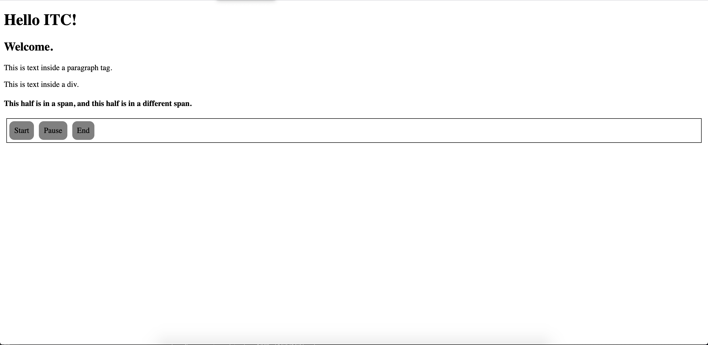
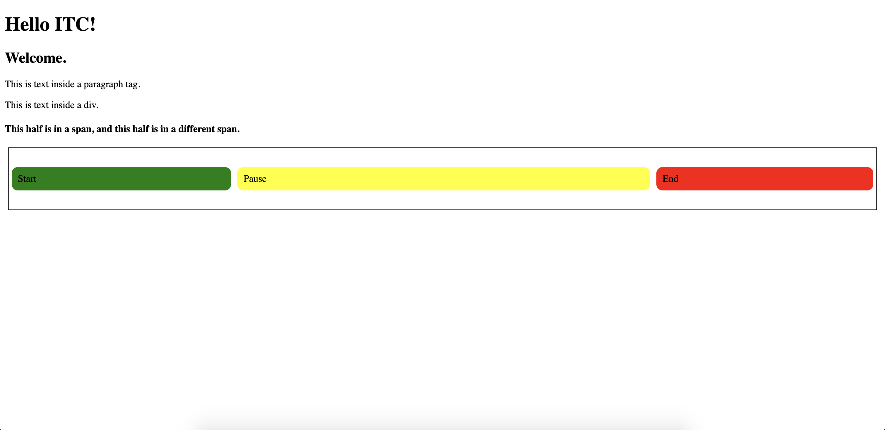

# Day 2: HTML and CSS Basics

In this lesson, you learn about page layout. Specifically, you learn how to:  

- Position a single element   
- Align multiple HTML elements in a row **or** column   
- Organize multiple HTML elements in rows **and** columns  
 
To position an single HTML element, you will learn about the `position` style property and its cousins `top`, `right`, `bottom`, and `left`. This collection of properties is great for positioning a single element with precision, like a navbar, footer, or icon. 

To align multiple elements in a row **or** column, you learn about the Flexbox collection of properties. Flexbox is a powerful toolset that makes it easy to align items in one dimension, center HTML elements or text, evenly space HTML elements, and create dynamic containers that adjust to content size and browser dimensions.

To align multiple elements in rows **and** columns, you learn about the Grid Layout collection of properties. Grid Layout is useful for creating page layouts in two dimensions. You can use a Grid Layout in creative ways to organize and display content.  

By the end of this lesson, you will have:

- Experience using the [`position` style property](#position-style-property)  
- The basics of using [Flexbox](#flexbox) for organizing HTML elements in a row or column    
- Knowledge of [CSS Grid Layout](#css-grid) for organizing HTML elements in rows and columns 
- Self study suggestions for building a layout and working with font awesome


## [Position Style Property](#position-style-property)  

The `position` style property allows you to control where an element is positioned on the page. The default value for `position` is `static`. This means that elements render in order as they are written in your code. You can override the default value to [position elements](https://www.w3schools.com/cssref/pr_class_position.asp) relative to specific elements on your page. Your other options for `position` are the values `absolute`, `relative`, `fixed`, and `sticky`. Here is an example of three classes:

```css
.header-title {
  font-size: 24px;
}

.header-subtitle {
  font-size: 24px;
  position: static;
}

.footer {
  font-size: 24px;
  position: absolute;
}
```

In the example above, the top two classes (`.header-title` and `.header-subtitle`) are `position: static`. This is the default for both, so you don't need to explicitly declare it. The only difference between the two is that one explicitly declares `position: static` and the other doesn't. Explicitly declaring the default value doesn't change it, and therefore both are `position: static`. The third class (`.footer`) is `position: absolute` because it overrides the default by explicitly declaring `position: absolute`.

Often used in combination with the `position` property are the properties `top`, `right`, `bottom`, and `left`. Their values are in pixels, like `top: 10px`, and are used with `position` to place HTML elements on the page. The properties `top`, `right`, `bottom`, and `left` influence an element only if the element is *positioned*. An element is positioned only if its `position` is anything other than `static`.

Using `top`, `right`, `bottom`, and `left` in combination with the `position` values other than `static` allow you to position an element with precision regardless of where its default position would be. To better understand how the `position`, `top`, `right`, `bottom`, and `left` values behave, here are a few notes and examples. 

When `position` has its default value of `static`, if you set `top`, `right`, `bottom`, and `left`, the `position: static` element responds to the document, not to its parent. Accordingly, statically positioned elements aren't influenced by `top`, `right`, `bottom`, and `left` values.

In contrast, the `absolute` value positions an element relative to its first *positioned* ancestor element. Note the requirement of a *positioned* ancestor. This means the `absolute` element needs to have a ancestor element that also has a `position` property set. For instance, if the parent element has `position: relative`, then the `position: absolute` child element will have properties for `top`, `right`, `bottom`, `left` that refer to the parent element.

```css
.section-wrapper {
  position: relative;
}

.footer {
  font-size: 24px;
  position: absolute;
  bottom: 0px;
  left: 0px;
  right: 0px;
}
```

In the example above, assume the HTML file is such that the `.section-wrapper` element wrap the `.footer` element. The `.footer` class has `position: absolute` and `0px` for each of `bottom`, `left`, and `right`. The `.section-wrapper` is a *positioned* ancestor of the `.footer` element because it is `position: relative` and wraps the `.footer` (i.e., the `position: absolute` element). This results in the `.footer` element appearing at the bottom of the `.section-wrapper` element and spanning that element's entire width.

When `relative`, the element is positioned using `top`, `right`, `bottom`, and `left` relative to its normal position. Because the element is *positioned* (i.e., its `position` is `relative` instead of `static`), it responds to values for `top`, `right`, `bottom`, and `left`. For instance, `position: relative; top: 10px` adds 10 pixels to the element's top position relative to where its position otherwise would be. See this StackOverflow post about [the difference between position static and relative](https://stackoverflow.com/questions/5011211/difference-between-static-and-relative-positioning). As you saw above for `absolute`, setting an element's position to `relative` is also used for *positioning* it so that it can serve as the positioned ancestor for an `absolute` element.

When `fixed`, the browser positions the element relative to the browser window. One effect of this is that the `position: fixed` element does not move when the user scrolls. For instance, a footer with `position: fixed; bottom: 0` will appear at the bottom of the browser even when the user scrolls.

```css
.footer {
  font-size: 24px;
  position: fixed;
  bottom: 0px;
  left: 0px;
  right: 0px;
}
```

In the example above, the `.footer` class has `position: fixed` and `0px` for each of `bottom`, `left`, and `right`. Used in combination, the `position`, `bottom`, `left`, and `right` result in a footer appearing at the bottom of the screen and spanning the entire width of the page, even when the user scrolls. You'll see an example of this in one of html files but for a navbar instead of a footer.

The `sticky` value positions an element relative to the user's scroll position. It exhibits both `relative` and `fixed` behavior. The `sticky` element acts like a `relative` element until the scroll position reaches a specified location in the viewport. Then, the `sticky` element acts like a `fixed` element. It remains in place. An element with `position: sticky; top: 200px;` is relatively positioned until the scroll location causes the element to be `200px` from the top. Then it sticks and remains `50px` from the top, even when the user scrolls.

To better understand the behavior of positioning properties, open in your browser the [positions](html/position.html) file so that you see the webpage (not the source code on GitHub). Open the inspector, and take turns toggling on and off the properties for the `.position-absolute` class of `right`, `bottom`, `left`, `height`, and `width`. Try different combinations of on and off and also try changing their values. See what happens. 

What happens when you change the `position` properties of either class to something else? When you change the `.position-absolute` value for `position` to `fixed`, where do those elements go? Are they both on the DOM? How can you tell?

For more examples and resources, visit [W3 Schools](https://www.w3schools.com/cssref/pr_class_position.asp), [CSS Tricks Position](https://css-tricks.com/almanac/properties/p/position/) and [CSS Tricks Top Right Bottom Left](https://css-tricks.com/almanac/properties/t/top-right-bottom-left/).

## [Flexbox](#flexbox)

Flexbox provides an efficient way to organize multiple HTML elements on a webpage in a column *or* row (i.e, in one dimension). In later chapters, you learn about positioning a single HTML element using the `position` property and about positioning multiple HTML elements on a webpage in a grid of rows *and* columns (i.e, two-dimentions).

Flexbox isn't just one style property. Rather, it consists of a collection of CSS style properties that can be used together. When using Flexbox, you turn one element into a flex container. The elements in that container will then display flex behavior, meaning that the container element can adjust the height, width, direction, and order based on the space available in the container and other considerations. 

Flexbox's behavior makes it a good choice when working with dynamic content. An example of its dynamic behavior, based on the screensize, is when a flex container expands an interior element's width to fill available free space due to a large screensize. In contrast, it also can shrink an interior element's width to prevent overflow. It can even handle elements that have dynamic size values, like `%` and wrap elements when the parent container lacks enough space to fit all in one row or column (which can make it's one-dimensional structure look like a grid). 

Flexbox's dynamic behavior also allows you to write code that changes orientation, direction, and proportion based on screensize or other factors. In contrast, using display properties of `block` or `inline` restrict you to top-bottom or left-right directions. This will make more sense when you see some examples.

Flexbox style properties are divided into two main categories: (1) those for the container element; (2) those for the interior elements. 

### Parent Flexbox Properties

Many powerful parent Flexbox properties exist. The main parent Flexbox property you should know is `display: flex`. Setting the `display` property to `flex` turns an HTML element into a Flexbox container. Without it, the other Flexbox properties won't work. 

Inside a flex container, elements are aligned on the main axis. The main axis of a `div` is the `x-axis`, so the elements inside a `div` Flexbox container will appear next to each other by default. Note that the flex container influences only the elements and content directly inside it. Not the elements inside those elements. 

Here is an example of a CSS class with its `display` property set to `flex`.

```css
.buttons-wrapper {
  border: 1px solid black;
  display: flex;
  margin: 5px;
}

.button {
  background-color: gray;
  border-radius: 10px;
  margin: 5px;
  padding: 10px;
}
```

In this example, the `.buttons-wrapper` class has its `display` property set to `flex` and a `border` and `margin`. The `.button` class has a background color, border-radius, margin, and padding. Here is the corresponding HTML:

```html
<!DOCTYPE html>
<html>
  <head>
    <link rel="stylesheet" href="../css/flexbox.css" />
    <title>Hello</title>
  </head>
  <body>
    <h1>Hello ITC!</h1>
    <h2>Welcome.</h2>
    <p>This is text inside a paragraph tag.</p>
    <div>This is text inside a div.</div>
    <h4>
      <span>This half is in a span, </span>
      <span>and this half is in a different span.</span>
    </h4>
    <div class="buttons-wrapper">
      <div class="button">Start</div>
      <div class="button">Pause</div>
      <div class="button">End</div>
    </div>
  </body>
</html>
```
The relevant elements are the `div` with its `class` set to `"buttons-wrapper"` and also the `div` elements inside it with their `class` set to `"button"`. Notice that the three buttons are nested inside the buttons-wrapper. Here is how the example looks in the browser:



Notice that the flex container takes up the entire line and that the three interior HTML elements appear next to each other on the x-axis.

Other display properties of the parent include `justify-content` and `align-items`. Used alone or in combination, you can position the interior elements within the flex container. For instance, you can center the interior elements either horizontally, vertically, or both. You also can position them all to the left, top, right, or bottom of the flex container.

The `justify-content` property lets you position items along the main axis. The `align-items` property lets you position items along the cross axis. In the example above, the `x-axis` is the main axis and the `y-axis` is the cross axis. To center the elements along the `x-axis`, use `justify-content: center`. To center the elements along the `y-axis`, use `align-items: center`. Modifying the CSS might look like this:

```css
.buttons-wrapper {
  align-items: center;
  border: 1px solid black;
  display: flex;
  height: 100px;
  justify-content: center;
  margin: 5px;
}

.button {
  background-color: gray;
  border-radius: 10px;
  margin: 5px;
  padding: 10px;
}
```
In the modified example above, you added `align-items`, `height`, and `justify-content` properties to the `.buttons-wrapper` class. The two flexbox properties are set to values that center the interior buttons and the `height` property is there to make it more obvious that the buttons are vertically centered. Here's what it looks like in the browser.


In addition to positioning *elements* inside a Flexbox container, you can use the technique above to position *text* horizontally and/or vertically inside an element. For instance, you could turn the `.button` class into a flex container with `align-items` and `justify-content` set to `center`. Then, the text inside the `.button` will appear in the middle of the button.

Centering is just one way you can position elements or text within a flex container. You also can align items at the start or end of the container. Plus, the parent container has many other Flexbox options, like `flex-direction` and `flex-wrap`. Check out [this great Flexbox guide](https://css-tricks.com/snippets/css/a-guide-to-flexbox/).

A note on `flex-direction` -- it flips which axis is the main and which is the cross access. This results in `align-items` and `justify-content` controlling whichever axis it didn't control by default instead of its default axis. In the example above, adding `flex-direction: column` to the `div` results in `align-items` controlling horizontal orientation of the child elements and `justify-content` controlling the vertical (the opposite of the default on a `div`).

### Child Flexbox Properties

The children elements in a Flexbox container also have their own properties. For instance, `flex-grow` and `flex-shrink` allow you to increase or decrease the size of an interior element based on the available space in the container. Each of them accept an integer as a value. That value determines the proportion of available space the item should occupy.

For example, for `flex-grow`, if all interior elements are `flex-grow: 1`, any extra space in the container will be distributed equally. If, however, one of the children is `flex-grow: 2`, it would try to occupy twice as much space as the others.

Here is an example CSS:

```css
.buttons-wrapper {
  align-items: center;
  border: 1px solid black;
  display: flex;
  height: 100px;
  justify-content: center;
  margin: 5px;
}

.button-start {
  background-color: green;
  border-radius: 10px;
  flex-grow: 1;
  margin: 5px;
  padding: 10px;
}

.button-pause {
  background-color: yellow;
  border-radius: 10px;
  flex-grow: 2;
  margin: 5px;
  padding: 10px;
}

.button-end {
  background-color: red;
  border-radius: 10px;
  flex-grow: 1;
  margin: 5px;
  padding: 10px;
}
```

This is a similar example to the ones before, but now you have three button classes. The `.button-start` and `.button-end` classes each have `flex-grow: 1` and the `.button-pause` class has `flex-grow: 2`. The HTML file in this example is basically the same as before, except now the new CSS class names for the buttons are matched to the corresponding HTML element. 

Here's what it looks like in the browser:



See that the pause button (i.e., the one with the `.button-pause` class) takes up twice as much extra space as the other two. 

Another common thing to do is set the child's `align-self` or `justify-self` properties to override the `align-items` or `justify-content` properties, respectively, as applied to that child. It essentially takes that child out of the normal flow. This is good, for example, if you want all elements centered in the flex container except for one of the elements. You can use`align-self` or `justify-self` on that child to position it.  

There is a lot more you can do with child components CSS flex properties, like even set the order in which they align themselves. Again, check out [this great Flexbox guide](https://css-tricks.com/snippets/css/a-guide-to-flexbox/).

Other resources that might help are [MDN's Flexbox basics](https://developer.mozilla.org/en-US/docs/Web/CSS/CSS_Flexible_Box_Layout/Basic_Concepts_of_Flexbox), [W3 Schools Flexbox](https://www.w3schools.com/css/css3_flexbox.asp), and [Flexbox Frogger](https://flexboxfroggy.com/).  


## [CSS Grid](#css-grid)

CSS Grid Layout is a grid-based layout system great for controlling your page layout by row and column. It provides an alternative to or supplement for working with the `position` style property and Flexbox. The `position` style property is useful for positioning individual elements and Flexbox is great for positioning in one dimension (column or row). Neither, however, is a great solution for positioning in two-dimensions. That's where Grid excels.

CSS Grid is a solution for positiong HTML elements in two-dimensions. In some ways Grid behaves like a table because you can layout the elements in columns and rows. Grid, however, is more dynamic and flexible than a table because in a Grid the container's child elements can overlap and layer. Hence, Grid offers the organization of a table but a flexibility similar to CSS positioned elements.

When deciding whether to use Grid, Flexbox, or `position`, ask what you're trying to position. If you're positioning a single element, then `position` or Flexbox are good tools. If you're positioning multiple elements in a row *or* column, then Flexbox is a good option. If you're positioning multiple elements in rows *and* columns, the Grid is a good option (or maybe a Flexbox container that wraps).

Similar to Flexbox, a Grid layout has a parent element with one or more child elements nested inside. To make the parent a Grid container, set its `display` property to `grid` or `inline-grid`.

```css
.grid-container {
  display: grid;
}
```

The HTML elements nested inside a `display: grid;` element will automatically become items within the grid. You can read more about the properties for [Grid containers](https://www.w3schools.com/css/css_grid_container.asp) and [Grid items](https://www.w3schools.com/css/css_grid_item.asp).

Meanwhile, here is an example using Grid. First, here is the HTML:

```html
<!DOCTYPE html>
<html>
  <head>
    <link rel="stylesheet" href="../css/grid.css" />
    <title>Hello</title>
  </head>
  <body>
    <div class="wrapper">
      <div class="box box-one">Box One</div>
      <div class="box box-two">Box Two</div>
      <div class="box box-three">Box Three</div>
    </div>
  </body>
</html>
```

Here is the corresponding CSS:

```css
.wrapper {
  display: grid;
  grid-template-columns: repeat(3, 1fr);
  gap: 10px;
  grid-auto-rows: minmax(100px, auto);
}

.box {
  align-items: center;
  color: darkorchid;
  display: flex;
  justify-content: center;
  font-size: 24px;
  padding: 10px;
}

.box-one {
  border: 1px solid black;
  grid-column: 1;
  grid-row: 1;
}

.box-two {
  border: 1px solid black;
  grid-column: 3 / 4;
  grid-row: 1 / 4;
}

.box-three {
  border: 1px solid black;
  grid-column: 1 / 3;
  grid-row: 2 / 4;
}
```

In the example above, the HTML element with the `.wrapper` class is the grid container. The `.wrapper` class defines the details for the columns, rows, and spacing of the grid. Here, the grid is 3 columns (`grid-template-columns: repeat(3, 1fr);`). See here for more about [`grid-template-columns`](https://developer.mozilla.org/en-US/docs/Web/CSS/grid-template-columns). The rows are each 100px in height and width (`grid-auto-rows`) with a 10px space (`gap`) between them. The `.wrapper` class wraps other HTML elements.

The classes `.box-one`, `.box-two`, and `.box-three` are assigned to HTML elements nested inside the `.wrapper` element. Each of those classes define by column and row where in the grid they are positioned. They can take up one square in the grid (i.e., an integer for each of the `grid-column` and `grid-row`), or they can take up multiple consecutive squares in the grid (i.e., a range of squares designated by `/` for one or both of `grid-column` and `grid-row` where the number after the `/` is not included). In the example, the `.box-one` class occupies a single square whereas the other classes occupy more. 

Here is what it looks like:


At this point you may be confused about when to use Grid and when to use Flexbox. Deciding whether to use Grid versus Flexbox is not always an easy decision. Consider some of their differences. Two main differences are:

- Flexbox allows each item to take up as much space as its content allows, whereas Grid has strict sizing that doesn't automatically adjust by default to its content size. 
- Flexbox can adjust the number of items in a row (or column) based on the browser's width (or height), whereas a Grid will maintain the same orientation by default regardless of the browser's width. 

These are [among the things to consider](https://developer.mozilla.org/en-US/docs/Web/CSS/CSS_Grid_Layout/Relationship_of_Grid_Layout) when deciding how to use Grid and Flexbox. Although you can oftentimes achieve the same result using either approach, one might be better for you than the other given your circumstances.

You can use Grid and the `property` style element together. If you add to the Grid container the `position: relative` style property, then it serves as both the Grid container and also the *positioned* element for any elements inside it. The wrapped elements can now use Grid for sizing, spacing and general layout, and also use `position: absolute` in combination with `top`, `right`, `bottom`, and `left` to take elements out of the flow of the general layout. Check out [how to use Grid with absolute positioning](https://developer.mozilla.org/en-US/docs/Web/CSS/CSS_Grid_Layout/Relationship_of_Grid_Layout#grid_and_absolutely_positioned_elements).

Look at the example located in the [grid file](html/grid.html) so that you see the webpage and open the files in a Code Editor. In the files, you'll see code that creates a CSS grid. View how it looks in the browser. Play around with the code to change the grid layout and other styles. 

Is the grid responsive? How can you use the `position` style property and Flexbox in combination with Grid?

Can you [make the same layout](https://developer.mozilla.org/en-US/docs/Web/CSS/CSS_Grid_Layout/Relationship_of_Grid_Layout#the_same_layout_with_css_grids) using Flexbox instead of Grid?

Try learning more about CSS Grid Layout on your own. MDN's article about the [relationship of grid layout to other layout methods](https://developer.mozilla.org/en-US/docs/Web/CSS/CSS_Grid_Layout/Relationship_of_Grid_Layout) and the [basics of CSS Grid](https://developer.mozilla.org/en-US/docs/Web/CSS/CSS_Grid_Layout). Think about [when to use Flexbox and when to use CSS grid](https://blog.logrocket.com/flexbox-vs-css-grid/). Also consider looking at [W3Schools](https://www.w3schools.com/css/css_grid.asp)'s documentation.


## [Self study](#font-awesome) 

Practice planning your page before actually writing the code. When planning, first it's important to pick whether you're writing your own custom CSS or using a framework. Although it's okay to occassionaly mix the two at times, you want to have one primary approach in that regard. Then, decide what the layout looks like on paper. 

Next, think about how you will use HTML and CSS to generate the basic layout (ignoring the finer details like text, font-size, color, etc.). Think about whether and how you can use the Grid system with Flexbox and `position`. Think about which containers will hold which elements. Once you have a decent idea, start writing your code.

Finally, on an unrelated note, check out [Font Awesome](#https://fontawesome.com/). It's a libarary of icons that you might find useful. Use what you learned about Bootstrap to install Font Awesome and use its documentation.
