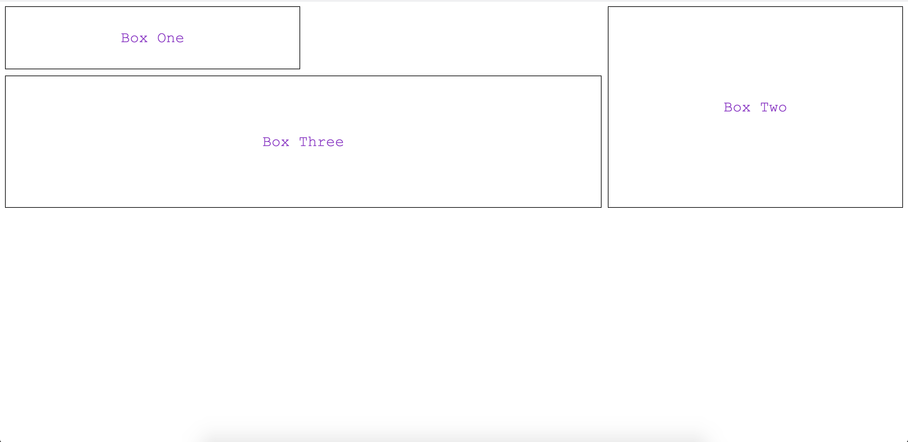
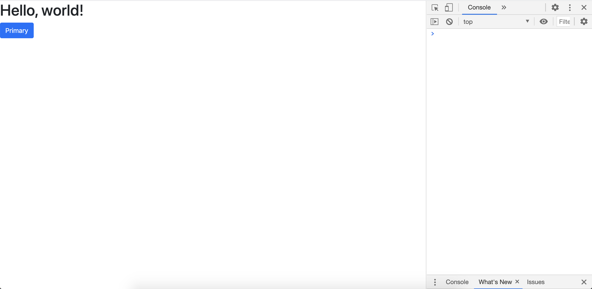

# Day 3: HTML and CSS Basics

In this lesson, you cover the very basics of using CSS Grid. This layout module is a powerful toolset for organizing HTML elements on a page in two-dimensions. It's a great supplement for working with flexbox and the `position` property to organize your pages. Next, you learn about Bootstrap, a popular framework for CSS. Rather than write your own CSS classes, import Bootstrap and use their CSS classes. Plus, by learning Bootstrap, you pracice working with external libraries for CSS.

By the end of this lesson, you will have:

- CSS grid layout basics
- An intro to Bootstrap
- Self study suggestions for building a layout and working with font awesome


## [CSS Grid](#css-grid)

CSS Grid Layout is a grid-based layout system great for controlling your page layout by row and column. It provides an alternative to or supplement for working with the `position` style property and flexbox. The `position` style property is useful for positioning individual elements and flexbox is great for positioning in one dimension (column or row). Neither, however, is a great solution for positioning in two-dimensions. That's where Grid excels.

CSS Grid is a solution for positiong HTML elements in two-dimensions. In some ways Grid behaves like a table because you can layout the elements in columns and rows. Grid, however, is more dynamic and flexible than a table because in a Grid the container's child elements can overlap and layer. Hence, Grid offers the organization of a table but a flexibility similar to CSS positioned elements.

When deciding whether to use Grid, flexbox, or `position`, ask what you're trying to position. If you're positioning a single element, then `position` or flexbox are good tools. If you're positioning multiple elements in a row *or* column, then flexbox is a good option. If you're positioning multiple elements in rows *and* columns, the Grid is a good option (or maybe a flexbox container that wraps).

Similar to flexbox, a Grid layout has a parent element with one or more child elements nested inside. To make the parent a Grid container, set its `display` property to `grid` or `inline-grid`.

```css
.grid-container {
  display: grid;
}
```

The HTML elements nested inside a `display: grid;` element will automatically become items within the grid. You can read more about the properties for [Grid containers](https://www.w3schools.com/css/css_grid_container.asp) and [Grid items](https://www.w3schools.com/css/css_grid_item.asp).

Meanwhile, here is an example using Grid. First, here is the HTML:

```html
<!DOCTYPE html>
<html>
  <head>
    <link rel="stylesheet" href="../css/grid.css" />
    <title>Hello</title>
  </head>
  <body>
    <div class="wrapper">
      <div class="box box-one">Box One</div>
      <div class="box box-two">Box Two</div>
      <div class="box box-three">Box Three</div>
    </div>
  </body>
</html>
```

Here is the corresponding CSS:

```css
.wrapper {
  display: grid;
  grid-template-columns: repeat(3, 1fr);
  gap: 10px;
  grid-auto-rows: minmax(100px, auto);
}

.box {
  align-items: center;
  color: darkorchid;
  display: flex;
  justify-content: center;
  font-size: 24px;
  padding: 10px;
}

.box-one {
  border: 1px solid black;
  grid-column: 1;
  grid-row: 1;
}

.box-two {
  border: 1px solid black;
  grid-column: 3 / 4;
  grid-row: 1 / 4;
}

.box-three {
  border: 1px solid black;
  grid-column: 1 / 3;
  grid-row: 2 / 4;
}
```

In the example above, the HTML element with the `.wrapper` class is the grid container. The `.wrapper` class defines the details for the columns, rows, and spacing of the grid. Here, the grid is 3 columns (`grid-template-columns: repeat(3, 1fr);`). See here for more about [`grid-template-columns`](https://developer.mozilla.org/en-US/docs/Web/CSS/grid-template-columns). The rows are each 100px in height and width (`grid-auto-rows`) with a 10px space (`gap`) between them. The `.wrapper` class wraps other HTML elements.

The classes `.box-one`, `.box-two`, and `.box-three` are assigned to HTML elements nested inside the `.wrapper` element. Each of those classes define by column and row where in the grid they are positioned. They can take up one square in the grid (i.e., an integer for each of the `grid-column` and `grid-row`), or they can take up multiple consecutive squares in the grid (i.e., a range of squares designated by `/` for one or both of `grid-column` and `grid-row` where the number after the `/` is not included). In the example, the `.box-one` class occupies a single square whereas the other classes occupy more. 

Here is what it looks like:



At this point you may be confused about when to use Grid and when to use flexbox. Deciding whether to use Grid versus flexbox is not always an easy decision. Consider some of their differences. Two main differences are:

- Flexbox allows each item to take up as much space as its content allows, whereas Grid has strict sizing that doesn't automatically adjust by default to its content size. 
- Flexbox can adjust the number of items in a row (or column) based on the browser's width (or height), whereas a Grid will maintain the same orientation by default regardless of the browser's width. 

These are [among the things to consider](https://developer.mozilla.org/en-US/docs/Web/CSS/CSS_Grid_Layout/Relationship_of_Grid_Layout) when deciding how to use Grid and flexbox. Although you can oftentimes achieve the same result using either approach, one might be better for you than the other given your circumstances.

You can use Grid and the `property` style element together. If you add to the Grid container the `position: relative` style property, then it serves as both the Grid container and also the *positioned* element for any elements inside it. The wrapped elements can now use Grid for sizing, spacing and general layout, and also use `position: absolute` in combination with `top`, `right`, `bottom`, and `left` to take elements out of the flow of the general layout. Check out [how to use Grid with absolute positioning](https://developer.mozilla.org/en-US/docs/Web/CSS/CSS_Grid_Layout/Relationship_of_Grid_Layout#grid_and_absolutely_positioned_elements).

Look at the example located in the [grid file](html/grid.html) so that you see the webpage and open the files in a Code Editor. In the files, you'll see code that creates a CSS grid. View how it looks in the browser. Play around with the code to change the grid layout and other styles. 

Is the grid responsive? How can you use the `position` style property and flexbox in combination with Grid?

Can you [make the same layout](https://developer.mozilla.org/en-US/docs/Web/CSS/CSS_Grid_Layout/Relationship_of_Grid_Layout#the_same_layout_with_css_grids) using flexbox instead of Grid?

Try learning more about CSS Grid Layout on your own. MDN's article about the [relationship of grid layout to other layout methods](https://developer.mozilla.org/en-US/docs/Web/CSS/CSS_Grid_Layout/Relationship_of_Grid_Layout) and the [basics of CSS Grid](https://developer.mozilla.org/en-US/docs/Web/CSS/CSS_Grid_Layout). Think about [when to use Flexbox and when to use CSS grid](https://blog.logrocket.com/flexbox-vs-css-grid/). Also consider looking at [W3Schools](https://www.w3schools.com/css/css_grid.asp)'s documentation.


## [Intro to Bootstrap](#intro-to-bootstrap)

### Bootstrap is a CSS Framework

[Bootstrap](https://getbootstrap.com/) is an open-source framework for stlying mobile-first, responsive web applications. The framework provides pre-written CSS and JavaScript-based templates. For instance, Bootstrap has templates for navigation bars, alerts, buttons, and more. They've written the code, you just import and use it in yours.

Bootstrap is important for you to learn because it is the most popular open-source styling framework and also because much of what you learn using Bootstrap can help you learn how to use other style frameworks -- public and private. Accordingly, it is good that you practice using Bootstrap so that you're familiar working with style frameworks generally. 

Anything you can do in plain CSS, Bootstrap has one or more pre-written templates that will do it for you (or at least get you close). For instance, you can use Bootstrap classes for [layout](https://getbootstrap.com/docs/4.5/layout/overview/), [content](https://getbootstrap.com/docs/4.5/content/reboot/), [forms](https://getbootstrap.com/docs/5.0/forms/overview/), [components](https://getbootstrap.com/docs/4.5/components/alerts/), and [more](https://getbootstrap.com/docs/4.5/utilities/borders/).

Whether to use Bootstrap, some other style framework, or your own custom CSS depends upon your situation. Sometimes your customer, team, or project will clearly require one over the others, in which case the decision is easy. Other times, you might get to choose. Consider what is most convenient for you in terms of writing clean code that is easy for you and others to maintain and understand.

Regardless of your choice for styling, be consistent throughout your project with your styling patterns. Choose one approach as your predominant way of styling. For instance, if you're using Bootstrap, try to do as much as you can with it instead of half Bootstrap, half custom CSS. It can get confusing if you mix and match Bootstrap with custom CSS or another framework. Accordingly, try to avoid mixing your style approaches. If you have to do some mixing, do so in a way that is clear, predictable, and easy to understand.

### Installing 

You need to install Bootstrap in your project. Several ways exist, and the [quick start](https://getbootstrap.com/docs/4.5/getting-started/introduction/) is a great way for many projects. As the instructions in the quick start explain, put the following code in the `head` tag of your HTML document:

```html
<link
  href="https://cdn.jsdelivr.net/npm/bootstrap@5.0.0-beta1/dist/css/bootstrap.min.css"
  rel="stylesheet"
  integrity="sha384-giJF6kkoqNQ00vy+HMDP7azOuL0xtbfIcaT9wjKHr8RbDVddVHyTfAAsrekwKmP1"
  crossorigin="anonymous"
/>
```

Also, put the following code at the bottom of your `body` tag in your HTML document:

```html
<script src="https://cdn.jsdelivr.net/npm/bootstrap@5.0.0-beta1/dist/js/bootstrap.bundle.min.js" integrity="sha384-ygbV9kiqUc6oa4msXn9868pTtWMgiQaeYH7/t7LECLbyPA2x65Kgf80OJFdroafW" crossorigin="anonymous"></script>
```

The `link` is the Bootstrap stylesheet. It's like when you import your own stylesheet, but this is Bootstrap's. Imgaine how big the stylesheet is! The `script` tag is necessary because many Bootstrap templates require JavaScript. Accordingly, the `script` tag gives you access to the necessary Bootstrap JavaScript code. 

Bootstrap even provides example HTML for you to test. Here is an example using Option 1 from their example, with a Bootstrap button added for effect:

```html
<!doctype html>
<html lang="en">
  <head>
    <!-- Required meta tags -->
    <meta charset="utf-8">
    <meta name="viewport" content="width=device-width, initial-scale=1">

    <!-- Bootstrap CSS -->
    <link href="https://cdn.jsdelivr.net/npm/bootstrap@5.0.0-beta1/dist/css/bootstrap.min.css" rel="stylesheet" integrity="sha384-giJF6kkoqNQ00vy+HMDP7azOuL0xtbfIcaT9wjKHr8RbDVddVHyTfAAsrekwKmP1" crossorigin="anonymous">

    <title>Hello, world!</title>
  </head>
  <body>
    <h1>Hello, world!</h1>
    <button type="button" class="btn btn-primary">Primary</button>

    <!-- Option 1: Bootstrap Bundle with Popper -->
    <script src="https://cdn.jsdelivr.net/npm/bootstrap@5.0.0-beta1/dist/js/bootstrap.bundle.min.js" integrity="sha384-ygbV9kiqUc6oa4msXn9868pTtWMgiQaeYH7/t7LECLbyPA2x65Kgf80OJFdroafW" crossorigin="anonymous"></script>
  </body>
</html>
```

If you load this HTML file in the browser, you will see this:



Notice the title's font is styled, so is the button, and no errors in the console. No custom CSS. Simply, you import Bootstrap and use their classes. Here, the style comes from the Bootstrap default styling for `h1` and `button` tags, plus their styles from the `btn` and `btn-primary` classes. Instead of looking to CSS documentation and your own stylesheet to figure out what `h1`, `button`, `btn` and `btn-primary` are, you look at Bootstrap's documentation. Examples below.

This installation is a quick and effective approach to working with Bootstrap. Check out other ways to [install Bootstrap](https://getbootstrap.com/docs/5.0/getting-started/download/).

### Examples Using Bootstrap

#### Layout

Bootstrap offers tempates for your page layout. Bootstrap's layout relies upon [containers](https://getbootstrap.com/docs/5.0/layout/containers/), rows, and [columns](https://getbootstrap.com/docs/5.0/layout/columns/) to create a [grid-like layout](https://getbootstrap.com/docs/5.0/layout/grid/), and [breakpoints](https://getbootstrap.com/docs/5.0/layout/breakpoints/) to adapt your layout in response to a particular viewport or device size. It is similar to Grid and flexbox, but it has its own syntax and quirks.

Containers center and horizontally pad your grid and are the outer-most wrapping element. Rows are elements nested directly inside containers and serve as containers for columns. Rows come with built-in values for `margin` and `padding`. You **must** use rows inside of a container. A good rule, is that if you use a container also use a row directly inside it, and if you use a row, wrap it with a container. 

Columns are nested inside rows. Each row has 12 columns. An element can span any number of the 12 rows. As you see in the Bootstrap examples, the Bootstrap classes for columns (`.col`) allow you to say how many (e.g., `.col-6`).

Use Bootstrap's built-in breakpoints to say how many columns an element should occupy depending upon the size of the browser. Bootstrap has six breakpoints. Extra small (`.col-xs-` or `.col-`), small (`.col-sm-`), medium (`.col-md-`), large (`.col-lg-`), extra large (`.col-xl-`), and extra extra large (`.col-xxl-`). The syntax means that the column at whichever designated screensize (and greater) will be the number of columns appearing after the second `-`. For instance, an element with (`.col-md-6`) will be 6 columns wide at medium-sized screensizes and greater. Below that, it is 12 columns because that is the default. 

You can add more than one breakpoint to an element. Here is an example of [mixing and matching](https://getbootstrap.com/docs/5.0/layout/grid/#mix-and-match):

```html
<div class="container">
  <!-- Stack the columns on mobile by making one full-width and the other half-width -->
  <div class="row">
    <div class="col-md-8">.col-md-8</div>
    <div class="col-6 col-md-4">.col-6 .col-md-4</div>
  </div>

  <!-- Columns start at 50% wide on mobile and bump up to 33.3% wide on desktop -->
  <div class="row">
    <div class="col-6 col-md-4">.col-6 .col-md-4</div>
    <div class="col-6 col-md-4">.col-6 .col-md-4</div>
    <div class="col-6 col-md-4">.col-6 .col-md-4</div>
  </div>

  <!-- Columns are always 50% wide, on mobile and desktop -->
  <div class="row">
    <div class="col-6">.col-6</div>
    <div class="col-6">.col-6</div>
  </div>
</div>
```


Read more about the [Bootstrap grid options](https://getbootstrap.com/docs/5.0/layout/grid/#grid-options) and read more about [how it works](https://getbootstrap.com/docs/5.0/layout/grid/#how-it-works) to learn Bootstrap's grid system.

#### Content and Forms

Bootstrap comes with templates that style the content on your webpage, like text, images, tables, and more. Its styles provide default built-in styles for HTML elements, like the `body`, `h1` to `h6` tags, `form` and others. Simply using the HTML tag with Bootstrap installed will result in the Bootstap style appearing on the browser.  

Bootstrap also provides Bootstrap classes for additional content styling that supplement or override the Bootstrap built-in styling. Use those styles by assigning them to an element's class attribute.

To learn more about Bootstrap content, check out their pages about [typography](https://getbootstrap.com/docs/5.0/content/typography/), [images](https://getbootstrap.com/docs/5.0/content/images/), [tables](https://getbootstrap.com/docs/5.0/content/tables/), and [figures](https://getbootstrap.com/docs/5.0/content/figures/). Be sure to look at the table on the right of each page in the links for content specific to that topic.

Also look at the documentation about [forms](https://getbootstrap.com/docs/5.0/forms/overview/). You'll find examples and guidelines for form control styles, layout options, and custom components for creating forms.

#### Components

Bootstrap provides templates for many components that are common across most webpages. An example is the [button](https://getbootstrap.com/docs/5.0/components/buttons/) you saw earlier. In addition to buttons, Bootstrap offers pre-built [alerts](https://getbootstrap.com/docs/5.0/components/alerts/), [badges](https://getbootstrap.com/docs/5.0/components/badge/), [cards](https://getbootstrap.com/docs/5.0/components/card/), [dropdowns](https://getbootstrap.com/docs/5.0/components/dropdowns/), [navigation](https://getbootstrap.com/docs/5.0/components/navs-tabs/), [spinners](https://getbootstrap.com/docs/5.0/components/spinners/), and more.

The components come in multiple options for size, color, and other properties. Mix and match to make your page look unique.

#### Utilities

Bootstrap has a ton of utility classes that allow you to build upon their other templates or use alone to style an element. Those utility classes include styles for CSS properties like borders, colors, display, flex, position, shadows, size, text, and others. Read about the [Bootstrap utility classes](https://getbootstrap.com/docs/5.0/utilities/colors/) to learn about what you can do with them.

Finally, you can override Bootstrap styles by using your custom CSS. Let's say you want a button of a certain color that you can't find in Bootstrap. Write your own CSS class and apply it to the Bootstrap button element. Make sure you import your CSS file in your HTML file in the `head` below where you import Bootstrap.


## [Self study](#font-awesome) 

Practice planning your page before actually writing the code. When planning, first it's important to pick whether you're writing your own custom CSS or using a framework. Although it's okay to occassionaly mix the two at times, you want to have one primary approach in that regard. Then, decide what the layout looks like on paper. 

Next, think about how you will use HTML and CSS to generate the basic layout (ignoring the finer details like text, font-size, color, etc.). Think about whether and how you can use the Grid system with flexbox and `position`. Think about which containers will hold which elements. Once you have a decent idea, start writing your code.

Finally, on an unrelated note, check out [Font Awesome](#https://fontawesome.com/). It's a libarary of icons that you might find useful. Use what you learned about Bootstrap to install Font Awesome and use its documentation.
